# 🚀 SANGRAHAK — AI-Powered Inventory & Depot Management System

> **SANGRAHAK** is an AI-powered inventory, warehouse/depot, supplier-risk, and logistics management platform designed to turn raw inventory transactions into operational decisions.

The system combines a **React frontend**, **Node.js/Express application backend**, **Python/Flask AI service**, **MongoDB Atlas**, **Redis**, real-time WebSocket communication, and machine-learning models for demand forecasting, stock prioritization, and supplier-risk analysis.

---

## 📌 Table of Contents

- [1. What SANGRAHAK Solves](#1-what-sangrahak-solves)
- [2. System Architecture](#2-system-architecture)
- [3. End-to-End Data Flow](#3-end-to-end-data-flow)
- [4. Technology Stack — What Each Technology Does](#4-technology-stack--what-each-technology-does)
- [5. Backend Architecture](#5-backend-architecture)
- [6. AI/ML Architecture](#6-aiml-architecture)
- [7. How the AI Models Work](#7-how-the-ai-models-work)
- [8. AI Decision Pipeline](#8-ai-decision-pipeline)
- [9. Database Architecture](#9-database-architecture)
- [10. Real-Time Processing](#10-real-time-processing)
- [11. Frontend / UI Architecture](#11-frontend--ui-architecture)
- [12. UI Screenshots](#12-ui-screenshots)
- [13. UI Information Architecture](#13-ui-information-architecture)
- [14. Reusable UI Components](#14-reusable-ui-components)
- [15. MongoDB Data Model](#15-mongodb-data-model)
- [16. Security & Configuration](#16-security--configuration)
- [17. Performance & Evaluation](#17-performance--evaluation)
- [18. Project Structure](#18-project-structure)
- [19. Getting Started](#19-getting-started)
- [20. Future Enhancements](#20-future-enhancements)
- [21. Authors](#21-authors)

---

# 1. What SANGRAHAK Solves

Traditional inventory systems mainly answer:

> **"How much stock do I have?"**

SANGRAHAK extends this into:

> **"What is likely to happen next, why is it happening, and what should the operator do?"**

The platform provides:

- Inventory visibility across multiple depots.
- Demand and sales forecasting.
- Stock-out risk identification.
- Reorder recommendations.
- Supplier delay, quality, and fulfillment risk analysis.
- Logistics transaction tracking.
- Depot capacity and utilization monitoring.
- Natural-language interaction through the SANGRAHAK AI chatbot.
- Operational reporting and export.
- Real-time alerts for important inventory events.

The core design separates **transaction/business processing** from **AI/ML computation**, allowing the Python service to handle computational workloads independently from the Node.js application backend.

---

# 2. System Architecture

## 2.1 High-Level Architecture

<p align="center">
  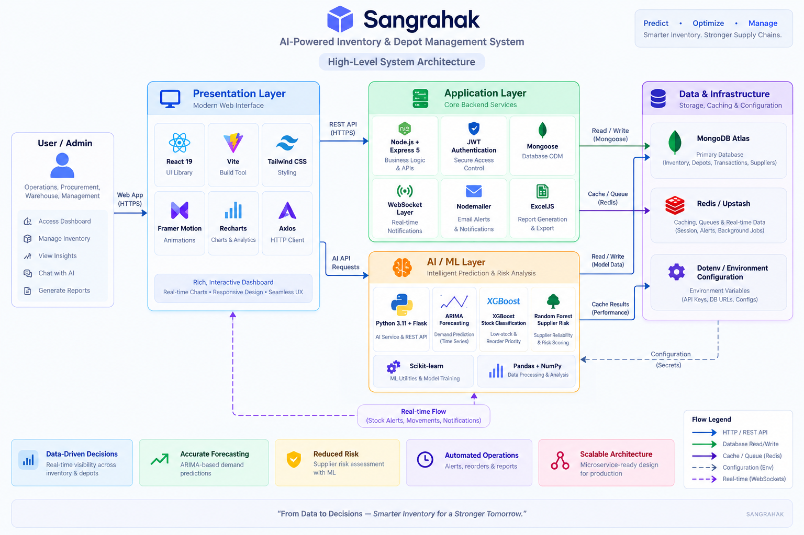
</p>

## 2.2 Responsibility of Each Layer

| Layer | Main Responsibility | Technologies |
|---|---|---|
| **Presentation** | User interaction, dashboards, charts, forms and AI chat | React 19, Vite, Tailwind CSS, Framer Motion, Recharts, Lucide Icons |
| **Application Backend** | Business rules, API endpoints, authentication, CRUD, transactions | Node.js, Express 5, JWT, Mongoose |
| **AI Service** | Forecasting, classification and supplier-risk computation | Python, Flask, ARIMA, XGBoost, Random Forest, Scikit-learn |
| **Primary Data Store** | Persistent products, depots, transactions and forecasts | MongoDB Atlas |
| **Cache / Queue Layer** | Fast temporary state, caching and queue-oriented workloads | Redis / Upstash |
| **Real-Time Layer** | Push operational events to connected clients | WebSockets |
| **Reporting / Communication** | Spreadsheet export and email-related workflows | ExcelJS, Nodemailer |
| **Configuration** | Secrets and environment-specific configuration | Dotenv |
| **Development / Versioning** | Scripts and source control | PowerShell, Git |

---

# 3. End-to-End Data Flow

SANGRAHAK follows a clear path from **user action → API → data → AI → decision → UI**.

## 3.1 Normal Inventory Operation

<p align="center">
  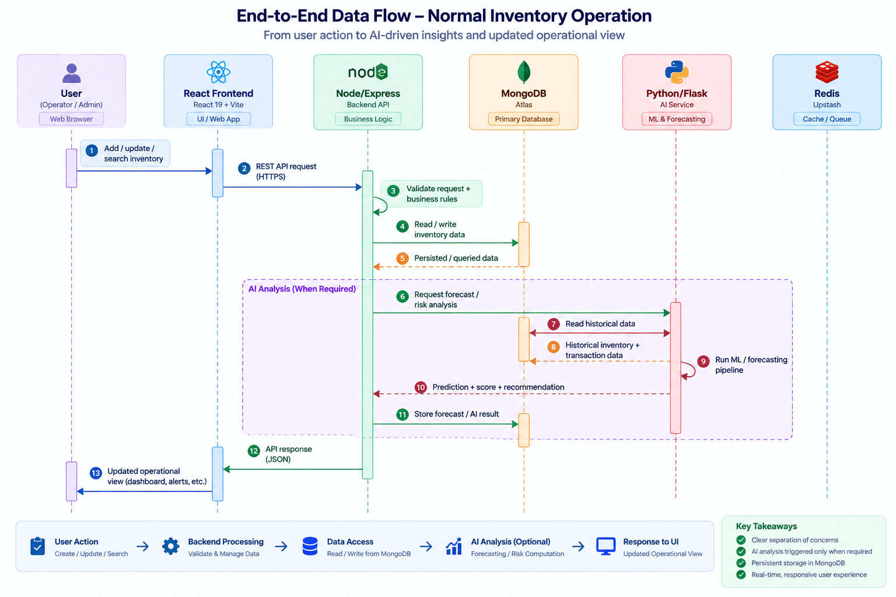
</p>

## 3.2 Example: Product Approaching Stock-Out

```text
Historical Sales
      │
      ▼
Daily / Weekly Demand Data
      │
      ▼
ARIMA Forecast
      │
      ├──► Expected future demand
      │
      ▼
Days-to-Empty / Stock Features
      │
      ▼
XGBoost Classification
      │
      ├──► Stock Status
      └──► Priority
      │
      ▼
Reorder Recommendation
      │
      ▼
Dashboard / Demand Intelligence UI
      │
      ▼
Operator → "Reorder Now"
```

This creates a decision loop rather than simply displaying raw stock numbers.

---

# 4. Technology Stack — What Each Technology Does

## 4.1 Frontend

### React 19

React is responsible for the application UI and component model.

It is used to build:

- Dashboard views.
- Inventory tables.
- Depot cards.
- Supplier risk views.
- Product-detail modals.
- AI chatbot.
- Reports.
- Search/filter controls.
- KPI cards and operational actions.

The UI is component-driven, allowing common elements such as badges, cards, buttons, tables and modals to be reused across modules.

### Vite

Vite provides the frontend development/build environment.

```text
Source Code
    │
    ▼
Vite Dev Server
    │
    ├── Fast development feedback
    └── Production build
            │
            ▼
        Browser
```

### Tailwind CSS

Tailwind is used for the visual system and responsive layout.

It provides utility classes for:

- Spacing.
- Typography.
- Grid/flex layouts.
- Responsive behavior.
- Cards.
- Buttons.
- Tables.
- Status states.
- Dark-themed UI styling.

### Framer Motion

Framer Motion provides UI motion and micro-interactions.

It is used conceptually for:

- Page transitions.
- Card animations.
- Modal transitions.
- Interactive feedback.
- Smooth state changes.

### Recharts

Recharts is the charting layer.

It powers analytical visualizations such as:

- Demand & Sales Intelligence.
- Category Distribution.
- Inventory Health.
- Depot utilization.
- Other dashboard analytics.

### Axios

Axios acts as the frontend HTTP client.

```text
React Component
      │
      ▼
Axios
      │
      ▼
REST API
      │
      ▼
Node / Python Service
      │
      ▼
JSON Response
      │
      ▼
React State
      │
      ▼
Updated UI
```

---

# 5. Backend Architecture

SANGRAHAK uses two backend services with different responsibilities.

## 5.1 Node.js + Express 5 — Application Backend

The Node.js backend is the main application/API layer.

### Responsibilities

- Business logic.
- REST API endpoints.
- User/admin operations.
- JWT authentication.
- Inventory CRUD.
- Product management.
- Depot management.
- Transaction management.
- MongoDB interaction through Mongoose.
- Communication with the AI service.
- WebSocket events.
- Email-related workflows through Nodemailer.
- Spreadsheet/report generation through ExcelJS.

### Request flow

```text
HTTP Request
    │
    ▼
Express Router
    │
    ▼
Authentication / Validation
    │
    ▼
Controller / Business Logic
    │
    ├──► Mongoose → MongoDB
    │
    ├──► Python AI Service
    │
    ├──► Redis
    │
    └──► WebSocket / Email / Export
    │
    ▼
JSON Response
```

## 5.2 Express.js 5

Express provides:

- HTTP server functionality.
- Routing.
- Middleware.
- API endpoint organization.
- Request/response handling.

The application backend becomes the controlled gateway through which frontend operations reach business data.

## 5.3 JSON Web Tokens (JWT)

JWT is used for authentication.

Conceptually:

```text
Login
  │
  ▼
Credentials validated
  │
  ▼
JWT issued
  │
  ▼
Frontend stores authentication state
  │
  ▼
Protected API request
  │
  ▼
JWT verification
  │
  ▼
Authorized operation
```

This prevents protected application operations from being treated as anonymous requests.

## 5.4 Mongoose

Mongoose provides the object/data modeling layer between Node.js and MongoDB.

```text
Node.js Application
       │
       ▼
   Mongoose Models
       │
       ▼
 MongoDB Collections
```

It is used for structured access to entities such as:

- Products.
- Depots.
- Transactions.
- Forecasts.

## 5.5 Nodemailer

Nodemailer provides email-related application functionality, such as sending operational notifications where configured.

## 5.6 ExcelJS

ExcelJS is used for spreadsheet-oriented reporting/export workflows.

---

# 6. AI/ML Architecture

The AI layer is intentionally separated from the Node.js application backend.

## 6.1 Why a Separate Python AI Service?

Machine-learning workloads use a Python ecosystem that is optimized for:

- Numerical computation.
- Statistical modeling.
- Data preprocessing.
- Classical machine learning.
- Time-series analysis.

Therefore:

```text
React
  │
  ▼
Node.js / Express
  │
  │ AI request
  ▼
Python / Flask
  │
  ├── ARIMA
  ├── XGBoost
  └── Random Forest
  │
  ▼
Prediction / Risk / Forecast
  │
  ▼
Node.js
  │
  ▼
React UI
```

This separation also allows the AI service to evolve independently from the application API.

---

# 7. How the AI Models Work

SANGRAHAK uses three major model families for different business problems.

## 7.1 Model 1 — ARIMA Demand Forecasting

### Problem

Inventory decisions require an estimate of future demand.

Current stock alone cannot tell an operator whether a product will run out next week.

### Input

The forecasting pipeline uses historical sales/demand observations.

```text
Historical Daily Sales
        │
        ▼
Time-Series Preparation
        │
        ▼
ARIMA Model Selection
        │
        ▼
ARIMA Forecast
        │
        ▼
Future Daily Demand
        │
        ▼
30-Day Forecast + Confidence Interval
```

### ARIMA Components

ARIMA represents a time series using:

- **AR — AutoRegressive:** uses previous observations.
- **I — Integrated:** differences the series to handle non-stationarity.
- **MA — Moving Average:** uses previous forecast errors.

The model is represented as:

```text
ARIMA(p, d, q)

p = autoregressive order
d = differencing order
q = moving-average order
```

### Output

The system stores forecast information such as:

- Predicted future sales.
- Confidence intervals.
- Forecast horizon.
- AI-generated inventory insights.

The README's reported implementation metrics include:

- AIC typically reported around **120–180** in the documented examples; lower values are preferred for model selection.
- 95% confidence intervals.
- A 30-day forecast horizon.
- Exponential Smoothing as a fallback when ARIMA does not converge on sparse data.

> **Important:** AIC/BIC are model-selection criteria, not accuracy percentages.

---

## 7.2 Model 2 — XGBoost Stock Status & Priority

### Problem

Forecasting demand is not enough. The system also needs to convert inventory conditions into an operational priority.

XGBoost is used as a gradient-boosting classifier for stock status/priority prediction.

### Features

The documented feature set includes:

```text
Current Stock
Daily Sales
Weekly Sales
Lead Time
Days to Empty
```

These features represent the current inventory position and the expected pressure on that inventory.

### Pipeline

```text
Current Inventory
      │
      ├── Current Stock
      ├── Daily Sales
      ├── Weekly Sales
      ├── Supplier Lead Time
      └── Days to Empty
      │
      ▼
Feature Vector
      │
      ▼
XGBoost Classifier
      │
      ├──► Stock Status
      │      ├── Understock
      │      └── Normal
      │
      └──► Priority
             ├── Critical
             ├── High
             └── Low
```

### Business interpretation

Instead of exposing only:

```text
Stock = 18
```

the system can expose:

```text
Risk = HIGH
Days Remaining = X
Forecast = Y
Reorder Point = Z
Suggested Quantity = N
```

This makes the model output actionable for an inventory operator.

The documented verification result reports approximately **92% precision for stock-out events**.

---

## 7.3 Model 3 — Random Forest Supplier Risk

### Problem

Supplier reliability directly affects inventory availability.

A supplier can create risk through:

- Delivery delays.
- Quality failures.
- Poor fulfillment.

The Supplier Risk Radar combines these factors into an overall procurement-risk view.

### Pipeline

```text
Supplier Historical Data
        │
        ├── Delivery Delay
        ├── Quality / Rejection
        └── Fulfillment Performance
        │
        ▼
Feature Preparation
        │
        ▼
Random Forest Predictors
        │
        ├──► Delay Score
        ├──► Quality Score
        └──► Fulfillment Score
        │
        ▼
Weighted Risk Score
        │
        ▼
Supplier Risk Radar
```

### Documented model outputs

The current README documents:

| Predictor | Documented evaluation |
|---|---|
| Delay Predictor | MSE < 2.5 days |
| Quality Predictor | Rejection-ratio accuracy ±0.5% |
| Fulfillment Predictor | Delivery accuracy ±2% |

### Overall risk score

The documented weighting is:

```text
Final Score =
    (Delay Score × 0.40)
  + (Quality Score × 0.30)
  + (Fulfillment Score × 0.30)
```

This gives delivery delay the largest contribution to the combined supplier-risk score.

---

# 8. AI Decision Pipeline

The three models solve different stages of the decision process.

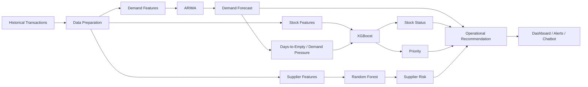

## 8.1 How the Models Complement Each Other

| Business Question | Model | Output |
|---|---|---|
| **How much demand is expected?** | ARIMA | Future demand forecast |
| **Is current inventory becoming dangerous?** | XGBoost | Stock status / priority |
| **Which supplier creates procurement risk?** | Random Forest | Supplier risk factors / score |
| **What should the operator see?** | Decision layer | Risk, forecast, reorder-oriented insight |

The important architectural point is that the models are **not interchangeable**.

- ARIMA is a **time-series forecasting** component.
- XGBoost is a **classification** component.
- Random Forest is used for **supplier-risk prediction**.
- The UI combines their outputs into an operational workflow.

---

# 9. Database Architecture

MongoDB Atlas is the primary persistent data store.

Redis / Upstash is used as a supporting cache/queue layer.

## 9.1 MongoDB

MongoDB is appropriate for the application because inventory entities contain nested and changing operational data, including depot distributions and forecast structures.

```text
                    MongoDB Atlas
                         │
       ┌─────────────────┼─────────────────┐
       │                 │                 │
   Products           Depots          Transactions
       │                 │                 │
       └─────────────────┼─────────────────┘
                         │
                     Forecasts
```

## 9.2 Redis / Upstash

Redis is used for fast temporary state and caching/queue-oriented workloads.

Typical architectural role:

```text
Application / AI Service
          │
          ▼
        Redis
       /     \
   Cache    Queue-oriented work
          │
          ▼
     Worker / Service
```

Redis should be treated as a performance/infrastructure layer rather than the source of truth. Persistent business data remains in MongoDB.

---

# 10. Real-Time Processing

The application includes WebSocket integration for operational events.

```text
Inventory Event
      │
      ▼
Node.js Backend
      │
      ▼
WebSocket Layer
      │
      ▼
Connected React Clients
      │
      ▼
Live UI Update
```

Examples include:

- Low-stock alerts.
- Stock movement notifications.
- Operational state changes.

This avoids forcing the browser to continuously refresh the entire dashboard for every event.

---

# 11. Frontend / UI Architecture

The UI is organized around **operational workflows**, rather than exposing raw backend entities.

## 11.1 Main Modules

```text
SANGRAHAK
│
├── Dashboard
│   ├── KPI Cards
│   ├── Demand & Sales Intelligence
│   ├── Category Distribution
│   └── Inventory Health
│
├── Demand Intelligence
│   ├── AI-Ranked At-Risk SKUs
│   └── Logistics Ledger
│
├── Inventory
│   ├── Inventory KPIs
│   ├── Search / Filters
│   ├── Inventory Table
│   └── Product Details
│
├── Supplier Risk Radar
│   ├── Procurement Risk KPIs
│   └── Supplier Risk Intelligence Desk
│
├── AI Chatbot
│   ├── Conversation
│   ├── Quick Starts
│   └── Operational Questions
│
├── Depot Management
│   ├── Network KPIs
│   ├── Depot Filters
│   └── Depot Cards
│
└── Reports & Export
    ├── Category Value
    ├── Depot Utilization
    └── Critical Low-Stock Items
```

## 11.2 UI-to-Backend Relationship

```text
Dashboard
   │
   ├── Inventory APIs
   ├── Forecast APIs
   ├── Risk APIs
   └── Depot APIs
          │
          ▼
      Node.js API
          │
     ┌────┴────┐
     ▼         ▼
 MongoDB     AI Service
               │
          ┌────┼────┐
          ▼    ▼    ▼
        ARIMA XGB   RF
```

The frontend therefore acts as the **presentation and decision surface**, while the backend and AI services perform data and computation work.

---

# 12. UI Screenshots

The following screenshots represent the implemented SANGRAHAK operational interface. The expected image assets are stored under `docs/ui/`.

## Operations Intelligence Dashboard

The dashboard acts as the primary command center.

It exposes:

- Total Products.
- Inventory Value.
- Stockout Risk.
- Active Depots.
- Critical SKUs.
- AI Model Score.
- Demand & Sales Intelligence.
- Category Distribution.
- Inventory Health.
- Global search and operational controls.

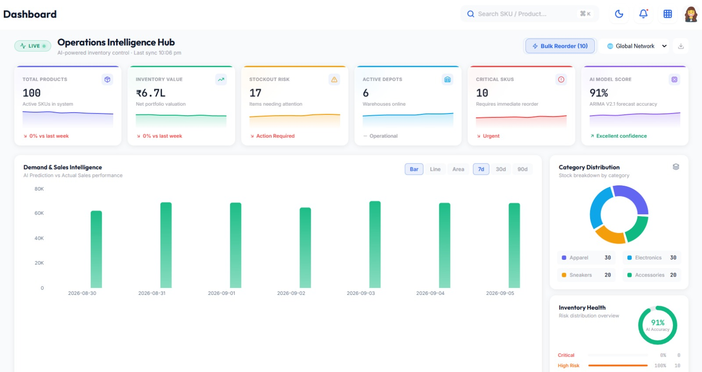

---

## Demand Intelligence & Logistics Ledger

This view connects model-driven stock risk with the operational movement ledger.

It exposes:

- AI-ranked at-risk SKUs.
- Risk badges.
- Current stock.
- Forecast.
- Days remaining.
- Reorder threshold.
- Suggested quantity.
- Reorder action.
- Logistics transactions.

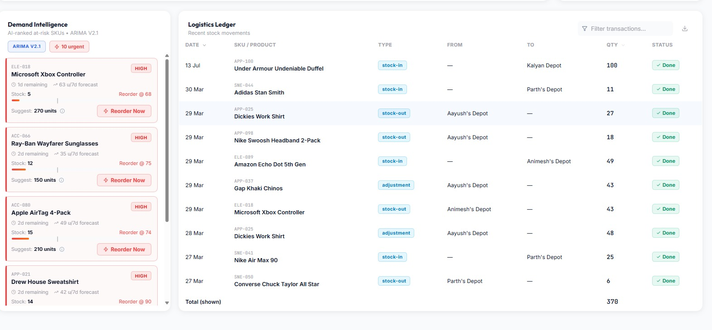

---

## Inventory Management

The inventory module provides a searchable and filterable SKU table.

It includes:

- Total items.
- Low-stock items.
- Expired items.
- Out-of-stock items.
- Category/depot filters.
- Search.
- Pagination.
- CSV upload.
- Add-items action.
- Stock-out horizon.
- Reorder quantity.
- Risk and forecast columns.

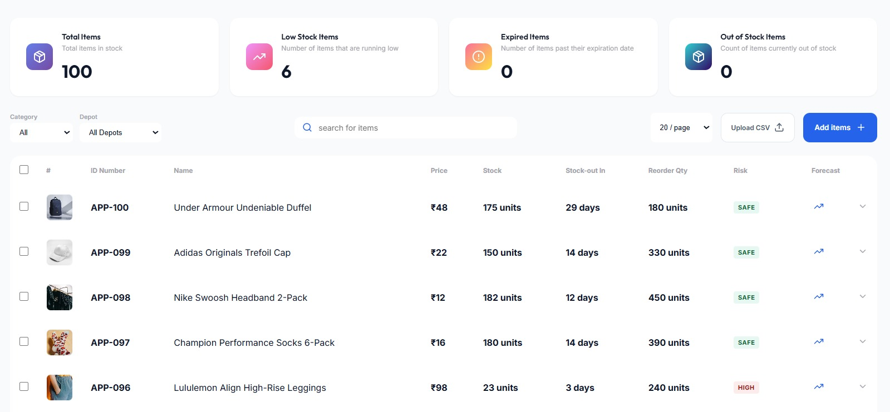

---

## Supplier Risk Radar

The Supplier Risk Radar provides procurement-focused risk intelligence.

It displays:

- Active risk events.
- Average delivery delay.
- Quality failures.
- Procurement loss risk.
- Delay score.
- Quality score.
- Fulfillment score.
- Overall supplier risk.
- Alert state.
- Supplier analysis action.

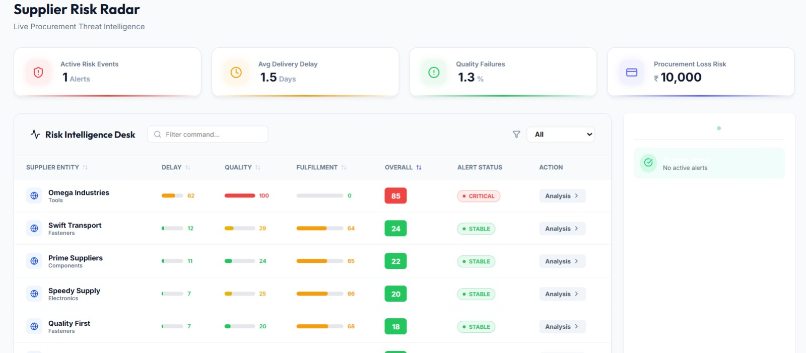

---

## SANGRAHAK AI Chatbot

The chatbot provides a natural-language interface over operational inventory information.

The UI includes:

- SANGRAHAK AI status.
- Conversation area.
- Quick-start prompts.
- Suggested operational questions.
- Chat input.
- Transaction history context.
- Active-alert context.
- Inventory analytics context.

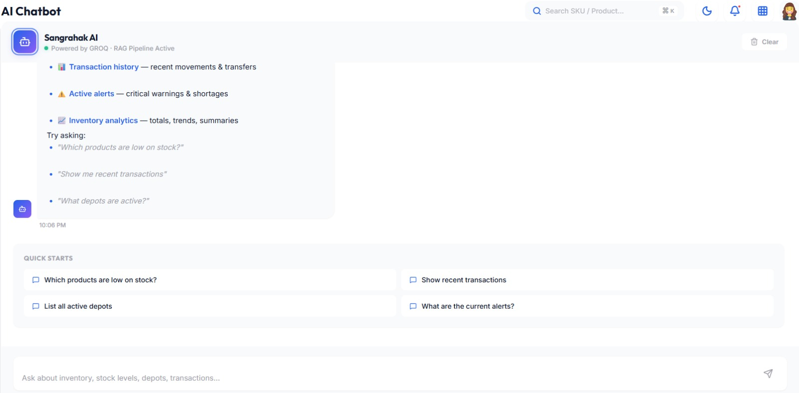

---

## Depot Management

Depot Management provides a network-level view of warehouse capacity and utilization.

It includes:

- Total depots.
- Total capacity.
- Active depots.
- Critical alerts.
- Depot search.
- Healthy / Warning / Critical filters.
- Utilization.
- Stored SKU count.
- Capacity.
- View Details.
- Edit / Delete.
- Register New Depot.

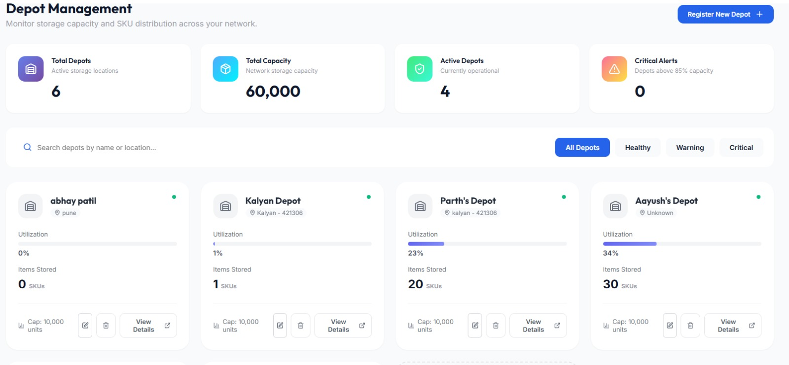

---

## Product Details

The Product Details modal provides a focused drill-down without leaving the inventory workflow.

It includes:

- Product image.
- SKU.
- Inventory status.
- Category.
- Supplier.
- Price.
- Total stock.
- Reorder point.
- Total inventory value.
- Depot-level stock distribution.

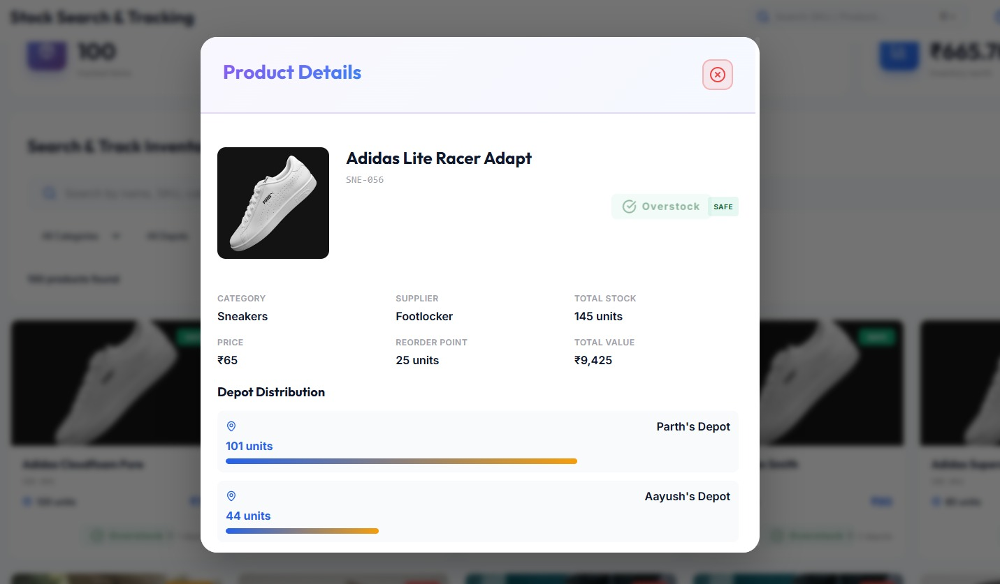

---

## Reports & Export

The reporting interface converts operational data into management-oriented summaries.

It includes:

- Category Value Breakdown.
- Depot Utilization.
- Capacity-versus-utilization indicators.
- SKU counts by depot.
- Critical Low-Stock Items.
- Reorder-point comparison.
- Urgency indicators.
- Export controls.

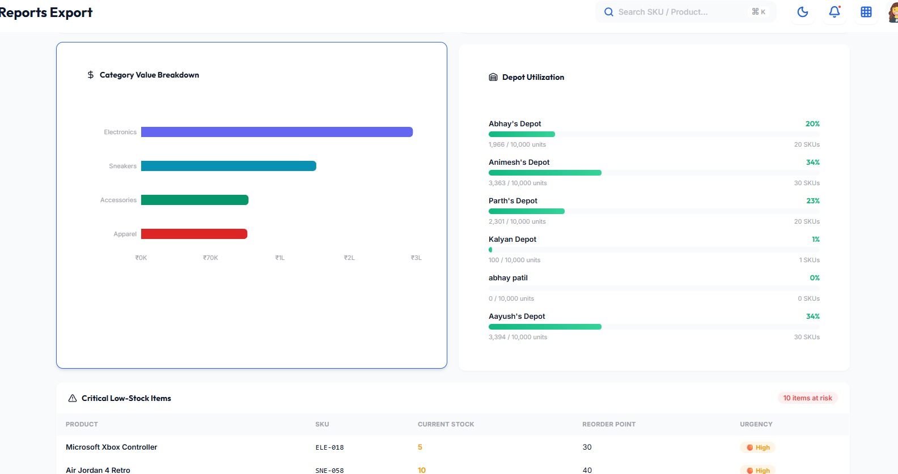

---

# 13. UI Information Architecture

The UI is organized around the lifecycle of an inventory decision:

```text
                    SANGRAHAK
                        │
        ┌───────────────┼────────────────┐
        │               │                │
        ▼               ▼                ▼
   MONITOR           ANALYZE          ACT
        │               │                │
        │               │                ├── Reorder
        │               │                ├── Add/Edit Item
        │               │                ├── Manage Depot
        │               │                └── Export Report
        │               │
        │               ├── Demand Forecast
        │               ├── Stock Priority
        │               └── Supplier Risk
        │
        ├── Dashboard
        ├── Inventory
        ├── Depots
        └── Alerts
                        │
                        ▼
                    AI ASSIST
                        │
                        └── SANGRAHAK AI Chatbot
```

### Navigation hierarchy

```text
SANGRAHAK
│
├── Dashboard
│   ├── KPI Cards
│   ├── Demand & Sales Intelligence
│   ├── Category Distribution
│   └── Inventory Health
│
├── Demand Intelligence
│   ├── At-Risk SKU Ranking
│   ├── Forecast
│   ├── Reorder Recommendation
│   └── Logistics Ledger
│
├── Inventory
│   ├── KPI Summary
│   ├── Search
│   ├── Filters
│   ├── Inventory Table
│   └── Product Details Modal
│
├── Supplier Risk Radar
│   ├── Risk KPIs
│   ├── Supplier Scores
│   └── Supplier Analysis
│
├── AI Chatbot
│   ├── Quick Starts
│   ├── Conversation
│   └── Operational Questions
│
├── Depot Management
│   ├── Network KPIs
│   ├── Status Filters
│   └── Depot Details
│
└── Reports & Export
    ├── Category Value
    ├── Depot Utilization
    └── Critical Low-Stock Items
```

---

# 14. Reusable UI Components

| Component | Purpose |
|---|---|
| KPI Card | Presents a high-value operational metric |
| Risk Badge | Makes risk states immediately scannable |
| Status Indicator | Shows healthy/warning/critical/live state |
| Progress Bar | Represents utilization, allocation or model factors |
| Search Input | Fast SKU/product/supplier/depot discovery |
| Filter Control | Narrows operational datasets |
| Date/Range Selector | Changes analytical horizon |
| Chart Toggle | Changes analytical visualization |
| Data Table | Displays dense operational records |
| Selection Checkbox | Enables single/bulk operations |
| Pagination | Handles larger datasets |
| Action Button | Starts operational workflows |
| Bulk Action | Applies actions to multiple records |
| Modal | Contextual drill-down |
| Quick Prompt | Starts common AI tasks |
| Chat Message | Represents AI/user interaction |
| Chart Legend | Explains visual metrics |
| Notification Control | Surfaces alerts |
| Depot Selector | Scopes operations to a depot/network |
| CSV Upload | Bulk inventory import |
| Export Control | Generates downloadable reports |
| Navigation Item | Moves between modules |
| Drill-down Action | Opens deeper product/supplier/depot analysis |

---

# 15. MongoDB Data Model

The documented data model contains four primary collections.

## 15.1 Products — `Product.js`

Stores core product metadata and aggregated stock.

```text
Product
├── sku
├── name
├── category
├── stock
├── reorderPoint
├── depotDistribution[]
│   ├── depotId
│   └── quantity
└── status
    ├── in-stock
    ├── low-stock
    ├── out-of-stock
    └── overstock
```

## 15.2 Depots — `Depot.js`

Represents warehouse/depot locations.

```text
Depot
├── name
├── location
├── capacity
├── currentUtilization
└── products[]
```

## 15.3 Transactions — `Transaction.js`

Provides an auditable record of stock movement.

```text
Transaction
├── type
│   ├── stock-in
│   ├── stock-out
│   └── transfer
├── productId
├── quantity
├── fromDepot
├── toDepot
└── reason
```

## 15.4 Forecasts — `Forecast.js`

Stores AI-generated forecast information so downstream views can reuse computed results.

```text
Forecast
├── sku
├── forecastData[]
│   ├── predicted sales
│   └── confidence information
├── stockStatusPred
└── aiInsights
    ├── Recommended Reorder
    └── ETA to Empty
```

## 15.5 Data Relationships

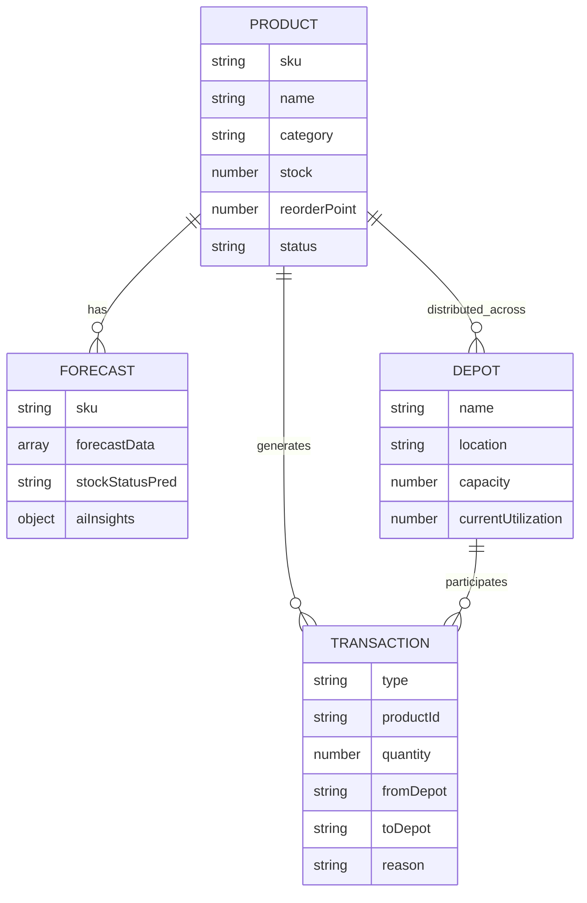

---

# 16. Security & Configuration

Environment-specific values should not be hard-coded into application source code.

The documented configuration includes:

```text
Backend/server/.env
Backend/code/.env
```

Important configuration values include:

```text
MONGODB_URI
JWT_SECRET
GROQ_API_KEY
```

The application uses JWT-based authentication for protected operations.

Recommended production practices include:

- Keep secrets outside source control.
- Use separate credentials per environment.
- Restrict database access.
- Validate incoming API payloads.
- Apply authorization before protected operations.
- Use HTTPS/TLS in production.
- Rotate credentials periodically.
- Avoid exposing model/service credentials to the browser.

---

# 17. Performance & Evaluation

## 17.1 Documented Model Results

The current project documentation reports:

| Area | Reported Result |
|---|---|
| Stock-out classification | ~92% precision |
| ARIMA stable-demand forecasting | ~85–90% accuracy |
| Supplier delay predictor | MSE < 2.5 days |
| Supplier quality predictor | Rejection ratio accuracy ±0.5% |
| Supplier fulfillment predictor | Delivery accuracy ±2% |

The documented ARIMA result is specifically associated with products having stable historical demand and more than 30 data points.

## 17.2 Operational Optimization

The system is designed to identify:

- Low-stock / at-risk inventory.
- Overstock / dead stock.
- Products approaching stock-out.
- Supplier procurement risk.
- Depot capacity pressure.

The resulting workflow moves from:

```text
Raw Data
   ↓
Prediction
   ↓
Risk Classification
   ↓
Operational Recommendation
   ↓
Human Action
```

rather than requiring users to manually interpret every raw transaction.

---

# 18. Project Structure

A representative project structure is:

```text
SANGRAHAK/
│
├── Frontend/
│   ├── React application
│   ├── Components
│   ├── Pages / Views
│   ├── API integration
│   └── UI assets
│
├── Backend/
│   ├── server/
│   │   ├── Node.js / Express application
│   │   ├── Routes
│   │   ├── Controllers
│   │   ├── Models
│   │   └── Configuration
│   │
│   └── code/
│       ├── Python / Flask AI service
│       ├── Forecasting
│       ├── ML models
│       └── Data processing
│
├── docs/
│   └── ui/
│       ├── dashboard.jpg
│       ├── demand-logistics.jpg
│       ├── inventory.jpg
│       ├── supplier-risk.jpg
│       ├── ai-chatbot.jpg
│       ├── depot-management.jpg
│       ├── product-details.jpg
│       └── reports-export.jpg
│
├── start-all.ps1
├── package.json
└── README.md
```

> The exact source-tree names can vary with the current implementation; the important architectural separation is **React → Node/Express → MongoDB**, with the **Python/Flask AI service** handling ML workloads.

---

# 19. Getting Started

## Prerequisites

- Node.js v18+
- Python 3.11+
- MongoDB Atlas URI

## Installation

```bash
git clone https://github.com/ShewaleParth/MajorProject.git
cd MajorProject
npm run install-all
```

`npm run install-all` is the documented root-level installation command for the frontend/backend/AI dependencies.

## Environment Setup

Configure the required environment variables in:

```text
Backend/server/.env
Backend/code/.env
```

At minimum, the documented configuration includes:

```env
MONGODB_URI=your_mongodb_connection_string
JWT_SECRET=your_jwt_secret
GROQ_API_KEY=your_groq_api_key
```

## Run the Services

On Windows PowerShell:

```powershell
.\start-all.ps1
```

---

# 20. Future Enhancements

Potential next-stage improvements for the architecture include:

- Background job workers for long-running forecasting tasks.
- Dedicated model/version registry.
- Feature-store-style management for ML features.
- Automated model retraining.
- Model drift monitoring.
- More sophisticated reorder optimization.
- Multi-depot inventory balancing.
- Event-driven ingestion for high-volume transactions.
- Distributed queue workers.
- Observability with structured logs and metrics.
- Role-based access control.
- Stronger API validation and rate limiting.
- Automated testing for model and business-rule behavior.

---

# 21. Authors

- **Parth Shewale** — Lead Developer — [@ShewaleParth](https://github.com/ShewaleParth)

---

<div align="center">

**SANGRAHAK — Efficiency in Motion**

*AI-assisted inventory intelligence for modern supply chains.*

</div>
