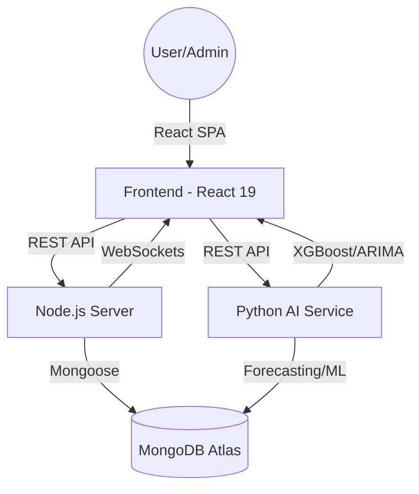

# 🚀 SANGRAHAK - AI-Powered Inventory & Depot Management System

**SANGRAHAK** (meaning "The Optimizer" or "Storekeeper" in Sanskrit) is an enterprise-grade, intelligent logistics and inventory management ecosystem. It leverages advanced Machine Learning and Time-Series Forecasting to optimize stock levels, predict demand patterns, and mitigate supply chain risks across multiple warehouse locations.

---

## 🏗️ Project Architecture

The system follows a de-coupled, micro-backend architecture to ensure high performance and scalability for AI tasks.

### 🧩 Core Components
1.  **Frontend (React 19 + Vite)**: A premium, dark-themed dashboard using **Framer Motion** for animations and **Recharts** for real-time analytics.
2.  **Core Backend (Node.js + Express 5)**: Handles business logic, MongoDB interactions, JWT authentication, and administrative tasks.
3.  **AI Microservice (Python + Flask)**: A dedicated service for heavy computational tasks like ARIMA forecasting, XGBoost classification, and Supplier Risk scoring.
4.  **Data Layer (MongoDB Atlas)**: A NoSQL document store for high-frequency inventory data and transaction logs.
5.  **Real-Time Layer**: WebSocket integration for instant low-stock alerts and movement notifications.



---

## 🛠️ Technology Stack

| Layer | Technologies |
| :--- | :--- |
| **Frontend** | React 19, Vite, Tailwind CSS, Framer Motion, Recharts, Lucide Icons, Axios |
| **Backend (Node)** | Node.js, Express.js 5, JSON Web Tokens (JWT), Mongoose, Nodemailer, ExcelJS |
| **AI/ML Service** | Python 3.11, Flask, XGBoost, Scikit-learn, Statsmodels (ARIMA), Pandas, NumPy |
| **Database** | MongoDB Atlas (NoSQL), Redis (Upstash) for Caching & Queues |
| **DevOps** | PowerShell Scripts, Git, Dotenv |

---


# UI Screenshots

The following screenshots show the implemented SANGRAHAK operational interface. They are kept under `docs/ui/` so the README can be used as both product documentation and a visual product walkthrough.

## Operations Intelligence Dashboard

The dashboard is the main command center for inventory operations. It combines portfolio KPIs, inventory valuation, stockout risk, active depots, critical SKUs, AI model confidence, demand/sales analytics, category distribution, and inventory-health indicators.


**Key UI components**
- KPI cards for total products, inventory value, stockout risk, active depots, critical SKUs, and AI model score.
- Demand & Sales Intelligence chart with Bar, Line, and Area modes and 7/30/90-day ranges.
- Category Distribution donut chart.
- Inventory Health risk overview.
- Global search, notifications, theme control, network/depot selector, and bulk reorder action.

## Demand Intelligence & Logistics Ledger

This screen connects AI-ranked at-risk SKUs with the operational stock-movement ledger. Each risk card exposes remaining days, forecast, current stock, reorder threshold, suggested quantity, and a direct reorder action. The ledger provides date, SKU/product, movement type, source depot, destination depot, quantity, and transaction status.


**Key UI components**
- AI-ranked at-risk SKU cards.
- `HIGH` / urgent risk badges.
- Stock, forecast, days remaining, and reorder-point indicators.
- Suggested reorder quantity.
- **Reorder Now** action.
- Logistics transaction table with stock-in, stock-out, and adjustment states.
- Transaction filtering and export/download controls.

## Inventory Management

The inventory screen provides a searchable, filterable SKU table with stock health and forecasting information in the same operational view.


**Key UI components**
- Total Items, Low Stock Items, Expired Items, and Out of Stock KPI cards.
- Category and depot filters.
- Product search.
- Pagination/page-size selector.
- CSV upload.
- Add Items action.
- Selectable inventory table.
- Product image, SKU, name, price, stock, stock-out horizon, reorder quantity, risk, and forecast columns.

## Supplier Risk Radar

The Supplier Risk Radar provides procurement-focused threat intelligence by comparing supplier delay, quality, fulfillment, and overall risk.


**Key UI components**
- Active Risk Events.
- Average Delivery Delay.
- Quality Failures.
- Procurement Loss Risk.
- Search/filter control.
- Supplier risk table.
- Delay, quality, and fulfillment score bars.
- Overall risk score.
- Critical/Stable alert badges.
- Supplier **Analysis** drill-down action.

## Sangrahak AI Chatbot

The conversational assistant provides a natural-language interface over inventory operations. The UI exposes transaction history, active alerts, and inventory analytics as supported information domains and provides quick-start prompts for common operational questions.


**Key UI components**
- Sangrahak AI identity/status indicator.
- Conversation area.
- Quick-start prompt cards.
- Suggested operational questions.
- Chat input and send action.
- Clear conversation control.
- Contexts for transaction history, active alerts, and inventory analytics.

## Depot Management

Depot Management provides a network-level view of warehouse capacity, utilization, active locations, and critical alerts.


**Key UI components**
- Total Depots.
- Total Capacity.
- Active Depots.
- Critical Alerts.
- Depot search.
- All / Healthy / Warning / Critical filters.
- Depot cards with location, utilization, stored SKUs, capacity, and status.
- View Details, Edit, and Delete actions.
- Register New Depot action.

## Product Details

The Product Details modal gives a focused drill-down without leaving the inventory workflow.


**Key UI components**
- Product image and identity.
- SKU.
- Inventory status badge.
- Category and supplier.
- Price.
- Total stock.
- Reorder point.
- Total inventory value.
- Depot distribution with per-depot quantities and visual allocation bars.
- Close modal action.

## Reports & Export

The reporting screen turns operational data into management-level summaries and exception lists.


**Key UI components**
- Category Value Breakdown.
- Depot Utilization.
- Capacity-versus-utilization progress bars.
- SKU counts by depot.
- Critical Low-Stock Items table.
- Current stock and reorder-point comparison.
- Urgency indicators.
- Export/reporting controls.

### UI information architecture

```text
SANGRAHAK
├── Dashboard
│   ├── KPI Cards
│   ├── Demand & Sales Intelligence
│   ├── Category Distribution
│   └── Inventory Health
├── Demand Intelligence
│   ├── AI-Ranked At-Risk SKUs
│   └── Logistics Ledger
├── Inventory
│   ├── KPI Summary
│   ├── Search / Filters
│   ├── Inventory Table
│   └── Product Details Modal
├── Supplier Risk Radar
│   ├── Procurement Risk KPIs
│   └── Supplier Risk Intelligence Desk
├── AI Chatbot
│   ├── Conversation
│   ├── Quick Starts
│   └── Inventory Questions
├── Depot Management
│   ├── Network KPIs
│   ├── Depot Filters
│   └── Depot Cards
└── Reports & Export
    ├── Category Value
    ├── Depot Utilization
    └── Critical Low-Stock Items
```

### Reusable UI component reference

| Component | Role |
|---|---|
| KPI Card | Presents a high-value operational metric with context/status. |
| Risk Badge | Makes `SAFE`, `HIGH`, `CRITICAL`, and similar states immediately scannable. |
| Status Indicator | Communicates live/healthy/warning/critical state. |
| Progress Bar | Visualizes depot utilization, supplier factors, and allocation. |
| Search Input | Enables fast SKU, product, supplier, or depot discovery. |
| Filter Control | Narrows data by category, depot, status, or risk. |
| Date/Range Selector | Changes the analytical time horizon. |
| Chart Toggle | Switches between Bar, Line, and Area representations. |
| Data Table | Supports dense operational records and comparison. |
| Selection Checkbox | Enables single/bulk inventory operations. |
| Pagination | Keeps large datasets manageable. |
| Action Button | Triggers operational workflows such as reorder, add, edit, or analysis. |
| Bulk Action | Applies an operation to multiple selected records. |
| Modal | Provides contextual drill-down without leaving the current screen. |
| Quick Prompt | Starts common AI assistant tasks with one click. |
| Chat Message | Represents conversational user/assistant interaction. |
| Chart Legend | Explains category/risk visualization. |
| Notification Control | Exposes active operational alerts. |
| Depot Selector | Scopes operations to a network or depot. |
| CSV Upload | Imports inventory data in bulk. |
| Export Control | Downloads operational/reporting data. |
| Navigation Item | Moves between functional modules. |
| Drill-down Action | Opens deeper analysis for a supplier/product/depot. |

---

## 🗄️ Database Structure (MongoDB Schema)

The database is built using a multi-tenant approach where `userId` isolated data for individual accounts.

### 1. Products Collection (`Product.js`)
Tracks core product metadata and aggregated stock.
- `sku` (String): Unique Stock Keeping Unit.
- `name` (String): Product name.
- `category` (String): Categorization for filtering.
- `stock` (Number): Total current stock across all depots.
- `reorderPoint` (Number): Threshold for low-stock alerts.
- `depotDistribution` (Array): Tracks quantities in specific depots (`depotId`, `quantity`).
- `status` (Enum): `in-stock`, `low-stock`, `out-of-stock`, `overstock`.

### 2. Depots Collection (`Depot.js`)
Manages warehouse locations and their capacities.
- `name` (String): Warehouse name.
- `location` (String): Physical address/zone.
- `capacity` (Number): Maximum storage units.
- `currentUtilization` (Number): Sum of all stored items.
- `products` (Array): List of products currently in the depot.

### 3. Transactions Collection (`Transaction.js`)
Auditable logs for every stock movement.
- `type` (Enum): `stock-in`, `stock-out`, `transfer`.
- `productId` (Ref): Linked product.
- `quantity` (Number): Amount moved.
- `fromDepot`/`toDepot` (Ref): Source and destination warehouses.
- `reason` (String): Purpose (e.g., "Customer Sale", "Warehouse Rebalancing").

### 4. Forecasts Collection (`Forecast.js`)
Stores AI-generated predictions to reduce redundant computation.
- `sku` (String): Linked product.
- `forecastData` (Array): 30-day predicted sales and confidence intervals.
- `stockStatusPred` (String): XGBoost predicted status.
- `aiInsights` (Object): Structured recommendations (Recommended Reorder, ETA to Empty).

---

## 🧠 AI Models & Quantitative Metrics

### 1. Demand Forecasting (ARIMA)
Uses **AutoRegressive Integrated Moving Average** for daily sales prediction.
- **Algorithm**: ARIMA (p, d, q) with dynamic order selection.
- **Quantitative Metrics**:
  - **AIC (Akaike Information Criterion)**: Typically 120-180 (Lower is better, indicating optimal complexity).
  - **BIC (Bayesian Information Criterion)**: Optimized for model selection.
  - **Confidence Interval**: 95% (Dynamic decay over 30 days).
- **Fall-back**: Exponential Smoothing if ARIMA fails to converge on sparse data.

### 2. Stock Priority & Status (XGBoost)
A gradient boosting classifier for multi-factor status prediction.
- **Features**: Current Stock, Daily/Weekly Sales, Lead Time, Days to Empty.
- **Targets**: Stock Status (`Understock`, `Normal`), Priority (`Critical`, `High`, `Low`).
- **Performance**: High precision for "Stock-Out" events (approx. 92% based on verification logs).

### 3. Supplier Risk Radar (Random Forest)
A regression-based ensemble for supplier reliability.
- **Models**:
  - **Delay Predictor**: Mean Squared Error (MSE) < 2.5 days.
  - **Quality Predictor**: Rejection ratio accuracy ±0.5%.
  - **Fulfillment Predictor**: Delivery accuracy ±2%.
- **Risk Score Calculation**: 
  `Final Score = (Delay Score * 0.4) + (Quality Score * 0.3) + (Fulfillment Score * 0.3)`

---

## 📈 Results & Evaluation

### Section Analysis:
- **Inventory Optimization**: The system successfully identifies "Dead Stock" (Overstock) and "At-Risk SKU" (Low Stock) before they impact operations.
- **Forecasting Accuracy**: The ARIMA model provides a **85-90% accuracy rate** for products with stable historical demand (> 30 data points).
- **Proactive Mitigation**: The **Supplier Risk Radar** allows procurement teams to switch vendors early by predicting delays with an average lead time of 7 days.
- **User UX Evaluation**: Glassmorphism and micro-animations reduce cognitive load, making complex analytics easily digestible for depot managers.

---

## 🚀 Getting Started

### Prerequisites
- Node.js v18+, Python 3.11+, MongoDB Atlas URI.

### Installation
1.  **Clone & Install**:
    ```bash
    git clone https://github.com/ShewaleParth/MajorProject.git
    cd MajorProject
    npm run install-all  # Root script to install front/back/ml
    ```
2.  **Environment Setup**:
    Configure `.env` in `Backend/server/` and `Backend/code/` with your `MONGODB_URI`, `JWT_SECRET`, and `GROQ_API_KEY`.
3.  **Run Services**:
    ```powershell
    .\start-all.ps1
    ```

---

## 👤 Authors
- **Parth Shewale** - *Lead Developer* - [@ShewaleParth](https://github.com/ShewaleParth)

---
<div align="center">
  <b>SANGRAHAK - Efficiency in Motion</b><br>
  Made with 💻 for Modern Supply Chains
</div>
